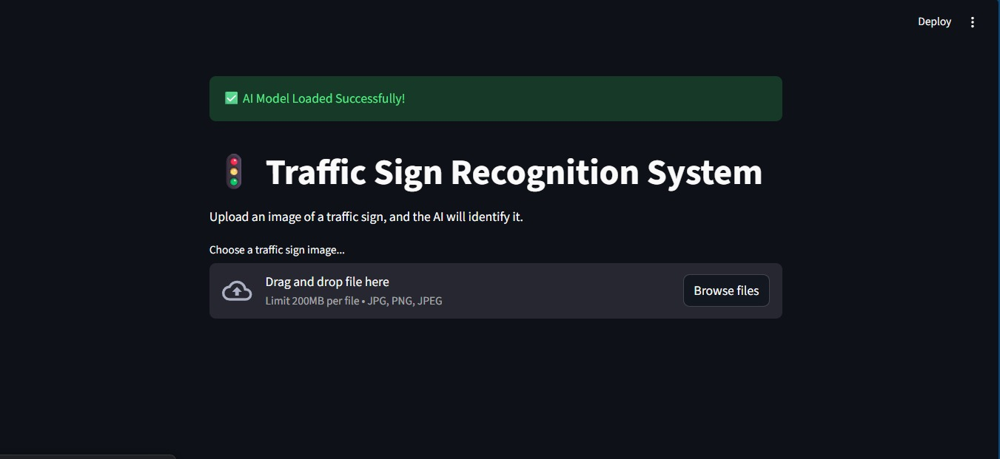
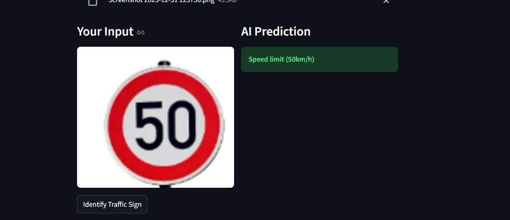
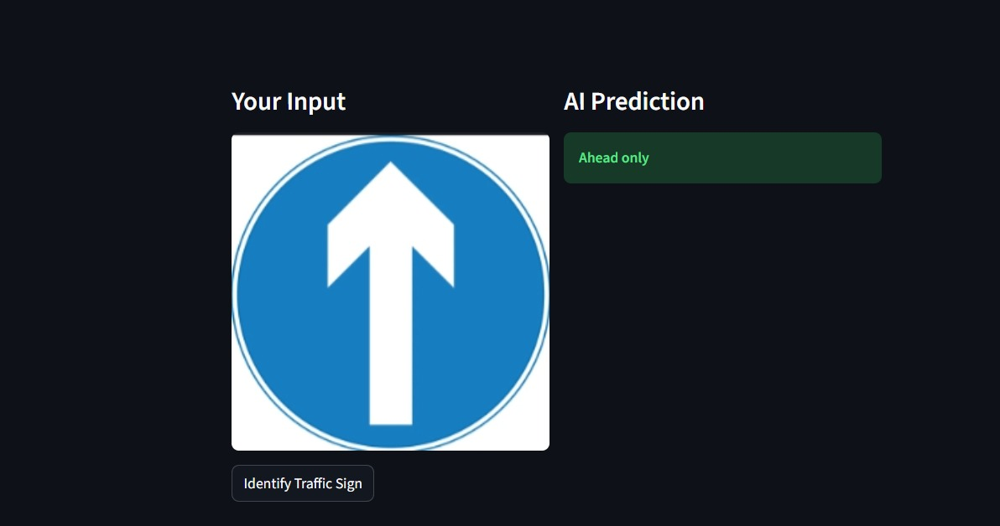

**🚸⛔ Traffic Signs Recognition System**

A Deep Learning Approach

Group 8 Project

**Team Members**

• Chibuike Macnelson – Team Lead

• Amuzat Habeeb

• Ejele Ngozi

• Sani Alamin Nazifi

• Eluchie Vivian

• Joseph Victor Osita

• Ekuma Chidinma

• Edon Annabella

• Idowu Favour

• Amadi Emmanuel

**Overview**

This project focuses on building an intelligent Traffic Sign Recognition System using Deep Learning.

The system is trained to automatically identify and classify traffic signs from images, helping improve road safety and supporting future intelligent transportation systems.

The project covers:

• Data preprocessing

• CNN model training

• Model evaluation

• Deployment using a Streamlit web application

**Goal**

To design and deploy a deep learning model that can accurately recognize and classify traffic signs from images in real time.

**Statement of the Problem**

Traffic signs are critical for road safety, but:

Human drivers can miss or misinterpret signs

Poor visibility, weather, or fatigue increases risk

There is a need for an automated system that can reliably recognize traffic signs to support drivers and autonomous vehicles.

**Objectives**

• Load and preprocess traffic sign image data

• Build a Convolutional Neural Network (CNN)

• Train and validate the model effectively

• Evaluate performance using test data

• Deploy the trained model using a simple web interface

**Project Scope**

Included:

• Traffic sign classification using images

• Model training and evaluation

• Web-based UI for predictions

Excluded:

• Real-time video detection

• Edge-device deployment (e.g., Raspberry Pi)

**Methodology**

The project was implemented in six phases:

• Data Loading \& Preprocessing

    • Loaded .p files (train, validation, test)

     •Normalized image pixel values

• Model Building

    • Built a CNN using TensorFlow \& Keras

    • Used convolution, pooling, dropout, and dense layers

• Model Training

    • Trained for 20 epochs

    • Used validation data to monitor performance

• Model Evaluation \& Tuning

    • Evaluated validation accuracy and loss

    • Generated confusion matrices

Test Evaluation

    • Tested on unseen data

    • Achieved high test accuracy (~96%)

• UI Integration (Streamlit)

    • Built a web app to upload images

    • Displayed predictions and confidence scores

**Tools \& Technologies**

• Python

• TensorFlow / Keras

• NumPy, Pandas

• Matplotlib \& Seaborn

• OpenCV \& PIL

• Google Colab

• Streamlit

**Results**

• Validation Accuracy: ~97%

• Test Accuracy: ~96%

• Strong performance across most traffic sign classes

• Accurate predictions on unseen images

**Discussion**

The CNN model performed very well despite using small image sizes (32×32).

Most misclassifications occurred in visually similar signs, which is expected.

The Streamlit app successfully demonstrates real-world usage by allowing users to upload images and receive instant predictions.

**Deep Learning Approach**

A Convolutional Neural Network (CNN) was used because it is highly effective for image-based tasks.

The model automatically learns important visual features such as edges, shapes, and patterns from traffic signs.

**Algorithm**

Convolutional Neural Network (CNN)

**Evaluation Metrics**

• Accuracy

• Loss

• Confusion Matrix

• Precision, Recall, F1-Score

**Streamlit Web Application**

Below are screenshots from the Streamlit-based web application developed for traffic sign recognition.

**Streamlit Home Page**

**Sample Prediction 1**

**Sample Prediction 2**

**Conclusion**

• The Traffic Sign Recognition System was successfully developed and deployed.

• The model achieved high accuracy and was integrated into a user-friendly web application using Streamlit.

• This project demonstrates the practical use of deep learning in real-world computer vision problems.

**References**

• German Traffic Sign Recognition Benchmark (GTSRB)

• TensorFlow \& Keras Documentation

